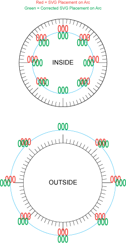

WIP

A small utility to correct the alignment of SVG text elements.


## Purpose
When placed radially, like on a gauge or dial, SVG text elements can look awful unless their positions are corrected for the eye.

In the following illustration, the red elements show text placement on the basis of polar to cartesian coordinates.
The green elements illustrate the correction made by the `ticktext` function.



## Installation

```console
npm install --save ticktext
```

## Usage

```typescript

import ticktext from 'ticktext';


const originalCoordinate = {x: 100, y: 100};
const angle = 90; // degrees
const text = '000'
const fontSize = 12;
const inside = true;


const newCoordinate = ticktext(originalCoordinate, angle, text, fontSize, inside);


```